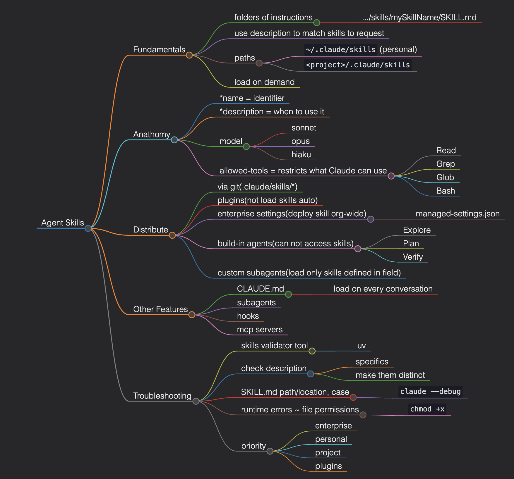

# ccaf
Claude Certified Architect – Foundations study sandbox

This repository contains my notes and practice code from 4 main courses described at https://anthropic.skilljar.com/page/claude-partner-network-learning-path

## Course Index

All course and topic mind maps now live under `mindmaps/` as `*.mm.md` files.

1. [Introduction to Agent Skills](mindmaps/introduction-to-agent-skills.mm.md)
2. [Building with the Claude API](mindmaps/building-with-the-claude-api.mm.md)
3. [Introduction to Model Context Protocol](mindmaps/introduction-to-model-context-protocol.mm.md)
4. [Claude Code in Action](mindmaps/claude-code-in-action.mm.md)
5. [Introduction to Sub-agents](mindmaps/introduction-to-sub-agents.mm.md)

### Introduction to Agent Skills

---

## References

- **Anthropic Learning Path**: https://anthropic.skilljar.com/page/claude-partner-network-learning-path
- **Claude API Documentation**: https://docs.anthropic.com/
- **Claude Code Documentation**: https://claude.ai/
